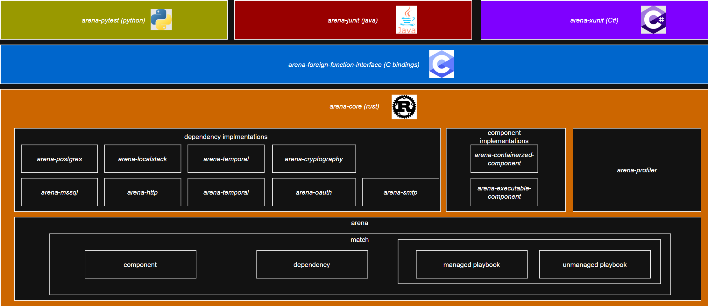
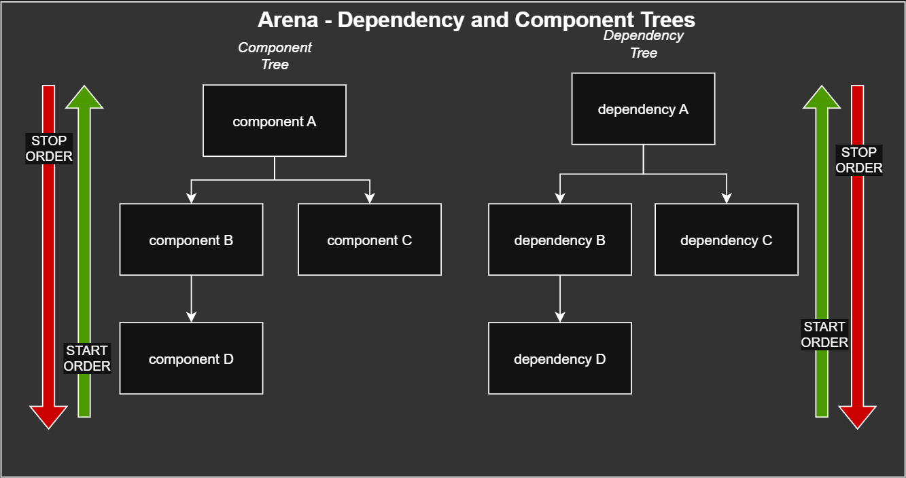

# Arena


[](https://github.com/daveepope/arena/actions/workflows/build-test-publish-arena.yml)
[](https://codecov.io/gh/daveepope/arena)
[](LICENSE)
[](https://scorecard.dev/viewer/?uri=github.com/daveepope/arena)
[](https://github.com/daveepope/arena/actions/workflows/osv-scanner.yml)
[](https://github.com/daveepope/arena/actions/workflows/dependency-review.yml)
[)](https://github.com/daveepope/arena/actions/workflows/build-test-publish-arena.yml)
[](https://github.com/daveepope/arena/actions/workflows/container-cves.yml)

Client packages (all built from the same release, so their versions always match):

[](https://pypi.org/project/arena-pytest/)
[](https://central.sonatype.com/artifact/io.github.stationdevx/arena-junit)
[](https://www.nuget.org/packages/ArenaDotnet.Xunit)

Arena is a cross-platform sandboxing framework. It manages the lifecycle of a set of dependencies (databases, brokers, HTTP services) and components (your applications) as a single sandbox you can open, interact with, and close, giving you repeatable, deterministic, multi-service environments with a fast feedback loop. Arena provides top-level clients for Python, Java, Go, and .NET (the Python client `arena-pytest`, Java client `arena-junit`, and .NET client `arena-xunit` all ship today; a Go client is planned). Component testing is one common use case, but Arena is equally at home as a local development sandbox, a scripted scenario driver, or anywhere else you need a reproducible multi-service environment.

## Overview

Arena models a sandbox using the concept of matches to manage the lifecycle of a set of dependencies and components (your applications).

The core framework is implemented in Rust. Clients call the core framework library through a C FFI layer which is completely hidden from application developers. The Python client (arena-pytest), Java client (arena-junit), and .NET client (arena-xunit) are available; a Go client is planned.



### Component and Dependency Trees



Any dependency or component can declare other dependencies/components as children, using the core trait's `add_child`, or the friendlier per-type builder methods `with_child_dependencies(...)` / `with_child_components(...)`. Each node just owns a list of its own children, forming an n-ary tree where nesting is unlimited: a child can have children of its own, and so on.

Use a dependency tree when one dependency needs another dependency already up and ready before it starts, e.g. a service that needs a broker or database dependency ready first, so the broker/database is declared as its child. Use a component tree the same way for your own applications, e.g. a component that needs a sidecar, proxy, or upstream service already running before it starts, so that upstream service is declared as its child.

```rust
let dependency_d = HttpDependency::builder("dependency-d").build();
let dependency_b = HttpDependency::builder("dependency-b")
    .with_child_dependencies(vec![Box::new(dependency_d)])
    .build();
let dependency_c = HttpDependency::builder("dependency-c").build();
let dependency_a = HttpDependency::builder("dependency-a")
    .with_child_dependencies(vec![Box::new(dependency_b), Box::new(dependency_c)])
    .build();

let component_d = ExecutableComponent::builder("component-d")
    .with_executable_path("/bin/true")
    .build();
let component_b = ExecutableComponent::builder("component-b")
    .with_executable_path("/bin/true")
    .with_child_components(vec![Box::new(component_d)])
    .build();
let component_c = ExecutableComponent::builder("component-c")
    .with_executable_path("/bin/true")
    .build();
let component_a = ExecutableComponent::builder("component-a")
    .with_executable_path("/bin/true")
    .with_child_components(vec![Box::new(component_b), Box::new(component_c)])
    .build();
```

For this tree, start order is depth-first, children before their parent, siblings in declared order:

`dependency_d → dependency_b → dependency_c → dependency_a`

Stop order is the exact reverse: a node stops itself before its children, and children stop in reverse declared order:

`dependency_a → dependency_c → dependency_b → dependency_d`

The same pattern applies to the component tree. This LIFO ordering is for nesting *within* one tree. Independent root-level dependencies/components registered on the same match run concurrently, all dependencies fully start before any component starts, and on stop all components stop before any dependency stops.

## Prerequisites

- Bazel (via [Bazelisk](https://github.com/bazelbuild/bazelisk) is recommended)
- Docker

## Installation

Build the project:

```bash
bazel build //...
```

Run the full test suite:

```bash
bazel test //...
```

## Usage

### Rust

```rust
use arena::{ClosedArena, Component, Dependency, Match, MatchTrait};
use arena_executable_component::executable_component::ExecutableComponent;
use arena_kafka::{KafkaDependency, KafkaFlavor};
use arena_postgres::PostgresDependency;

let postgres: Dependency = Box::new(
    PostgresDependency::builder("readings")
        .with_port(5432)
        .with_database_name("mydb")
        .build(),
);

let kafka: Dependency = Box::new(
    KafkaDependency::builder("readings")
        .with_flavor(KafkaFlavor::ApacheNative)
        .with_port(9092)
        .with_topic("events")
        .build(),
);

let web_app: Component = Box::new(
    ExecutableComponent::builder("my service")
        .with_executable_path("/path/to/your/binary")
        .build(),
);

let a_match = Match::new("my-test", vec![postgres, kafka], vec![web_app]);
let closed = ClosedArena::new("Arena".to_string(), vec![Box::new(a_match)]);
let open = closed.open().await;

// Interact with the open arena
// ...

open.close().await;
```

You can also use `with_source_path` / `with_build_tool` on the builder so Arena builds the binary before starting it (see `examples/`).

**Playbooks**: register a `Managed*Playbook` (or your own `Playbook` implementation for unmanaged behavior) on the `Match` via `register_playbook(playbook, exec_on_dependency_start)`, then open scoped ones yourself with `dependency.playbook().run().await` when a test needs them. See [Playbooks](#playbooks) below for the full picture.

### Python (arena-pytest)

Published on PyPI: [arena-pytest](https://pypi.org/project/arena-pytest/)

```python
from arena_pytest import (
    ClosedArena,
    MatchBuilder,
    ExecutableComponentBuilder,
    HttpReadinessCheck,
    KafkaDependencyBuilder,
    KafkaFlavor,
    PostgresDependencyBuilder,
)

postgres = (
    PostgresDependencyBuilder("db")
    .with_port(5432)
    .with_database_name("mydb")
    .build()
)

kafka = (
    KafkaDependencyBuilder("kafka")
    .with_flavor(KafkaFlavor.APACHE_NATIVE)
    .with_port(9092)
    .with_topic("events")
    .build()
)

component = (
    ExecutableComponentBuilder("my service")
    .with_executable_path("/path/to/your/binary")
    .with_readiness_check(HttpReadinessCheck(), "http://127.0.0.1:8080/health")
    .build()
)

a_match = (
    MatchBuilder("my-test")
    .add_dependency(postgres)
    .add_dependency(kafka)
    .add_component(component)
    .build()
)

closed = ClosedArena("Arena", [a_match])
open_arena = await closed.open()

# Interact with open_arena
# ...

await open_arena.close()
```

As in Rust, you can point at source plus `with_build_tool(...)` instead of a prebuilt path when you want Arena to compile the component first.

#### Python playbooks

Register a `Managed*Playbook` (or your own class extending `Playbook`/`UnmanagedPlaybook`) on the `MatchBuilder` alongside your dependencies, then stack `@playbook(YourPlaybook)` decorators on a test to activate it just for that test:

```python
a_match = (
    MatchBuilder("my-test")
    .add_dependency(mssql)
    .register_playbook(
        ResetValidationDbPlaybook(mssql.identifier),
        exec_on_dependency_start=False,
    )
    .build()
)

@playbook(ResetValidationDbPlaybook)
def test_create_reading_with_validation_db_scoped_playbook(api_client):
    # the table is reset once this test finishes
    ...
```

See [Playbooks](#playbooks) below for the full picture, including how to write your own unmanaged playbook.

### Java (arena-junit)

Published on Maven Central: [io.github.stationdevx:arena-junit](https://central.sonatype.com/artifact/io.github.stationdevx/arena-junit)

`arena-junit` is a JUnit 5 extension. You point it at the jar your build already produces, so a test runs against the same artifact you ship rather than a separate in-process test context.

#### Java setup

`arena-junit` publishes its native library as a separate Maven classifier per platform (`linux-x86_64`, `osx-aarch_64`, `osx-x86_64`) instead of bundling every platform into one jar. Add the [`os-maven-plugin`](https://github.com/trustin/os-maven-plugin) so the right classifier resolves automatically for your machine:

```xml
<build>
  <extensions>
    <extension>
      <groupId>kr.motd.maven</groupId>
      <artifactId>os-maven-plugin</artifactId>
      <version>1.7.1</version>
    </extension>
  </extensions>
</build>

<dependency>
  <groupId>io.github.stationdevx</groupId>
  <artifactId>arena-junit</artifactId>
  <version>${arena.version}</version>
  <classifier>${os.detected.classifier}</classifier>
</dependency>
```

Gradle (Kotlin DSL), using the [`osdetector`](https://github.com/google/osdetector-gradle-plugin) plugin:

```kotlin
plugins {
  id("com.google.osdetector") version "1.7.3"
}

dependencies {
  testImplementation("io.github.stationdevx:arena-junit:$arenaVersion:${osdetector.classifier}")
}
```

#### Java annotation style declaration

Put `@Arena` on the test class, annotate your dependencies and components as static fields, and Arena wires the sandbox for you before any test method runs.

```java
@Arena
final class ReadingsComponentTest {

  @ArenaDependency
  static final PostgresDependency POSTGRES =
      new PostgresDependencyBuilder("readings-db")
          .withPort(5432)
          .withDatabaseName("readings")
          .withDatabaseUsername("readings_user")
          .withDatabasePassword("readings_password")
          .build();

  @ArenaComponent
  static final ExecutableComponent WEB_APP =
      new ExecutableComponentBuilder("readings-app")
          .withExecutablePath("/path/to/readings-app.jar")
          .withEnvVar("POSTGRES_CONNECTION_STRING", "host=localhost port=5432 dbname=readings")
          .withReadinessCheck(HttpReadinessCheck.create(), "http://127.0.0.1:8080/health")
          .build();

  @Test
  void createReadingIsListed() throws Exception {
    // call the app over HTTP, same as any other component test
  }
}
```

Postgres and the app start at the same time rather than one after the other, so adding another dependency does not add its startup time on top of the rest.

Need a second copy of your service, or a second service alongside it, for a domain test or a scale test? Add another field:

```java
@ArenaComponent
static final ExecutableComponent WEB_APP_2 =
    new ExecutableComponentBuilder("readings-app-2")
        .withExecutablePath("/path/to/readings-app.jar")
        .withEnvVar("POSTGRES_CONNECTION_STRING", "host=localhost port=5432 dbname=readings")
        .withReadinessCheck(HttpReadinessCheck.create(), "http://127.0.0.1:8081/health")
        .build();
```

Both instances run in the same sandbox against the same Postgres, so you can test how your service behaves with two copies of itself running, or bring in another team's service and test the two together.

#### Java building the arena yourself

If you would rather not use field scanning, build the same sandbox by hand with `MatchBuilder` and open it in a plain JUnit lifecycle method:

```java
final class ReadingsComponentTest {

  private static OpenArena openArena;

  @BeforeAll
  static void openArena() throws Exception {
    PostgresDependency postgres =
        new PostgresDependencyBuilder("readings-db")
            .withPort(5432)
            .withDatabaseName("readings")
            .build();

    ExecutableComponent webApp =
        new ExecutableComponentBuilder("readings-app")
            .withExecutablePath("/path/to/readings-app.jar")
            .withReadinessCheck(HttpReadinessCheck.create(), "http://127.0.0.1:8080/health")
            .build();

    Match match =
        new MatchBuilder("readings")
            .addDependency(postgres)
            .addComponent(webApp)
            .build();

    openArena = new ClosedArena("readings-arena", List.of(match)).open();
  }

  @AfterAll
  static void closeArena() {
    openArena.close();
  }

  @Test
  void createReadingIsListed() throws Exception {
    // call the app over HTTP, same as any other component test
  }
}
```

Use this when you want full control over when the sandbox opens and closes, for example sharing one arena across several test classes yourself instead of letting `@Arena` manage it.

#### Java playbooks

Declare a `Managed*Playbook` (or your own class implementing `Playbook`/`UnmanagedPlaybook`) as an `@ArenaPlaybook` static field alongside your dependencies, then stack `@Playbook(YourPlaybook.class)` on a `@Test` method to activate it just for that test:

```java
@ArenaPlaybook(execOnDependencyStart = false)
static final ResetValidationDbPlaybook RESET_VALIDATION_DB =
    new ResetValidationDbPlaybook(MSSQL.identifier());

@Test
@Playbook(ResetValidationDbPlaybook.class)
void createReadingWithValidationDbScopedPlaybook() throws Exception {
  // the table is reset once this test finishes
}
```

See [Playbooks](#playbooks) below for the full picture, including how to write your own unmanaged playbook.

### .NET (arena-xunit)

Published on NuGet: [ArenaDotnet.Xunit](https://www.nuget.org/packages/ArenaDotnet.Xunit)

`arena-xunit` is an xUnit v2 extension targeting `netstandard2.0`, so it works from both .NET Framework and modern .NET test projects. You point it at the executable your build already produces, so a test runs against the same artifact you ship rather than a separate in-process test context.

#### C# xunit annotation style declaration

Put your dependencies and components as `[ArenaDependency]` / `[ArenaComponent]` static fields on a class that extends `ArenaCollectionFixture`, then have your test class implement xUnit's `IClassFixture<T>` to receive the shared, already-open arena before any test method runs.

```csharp
public sealed class ReadingsFixture : ArenaCollectionFixture
{
    [ArenaDependency]
    private static readonly PostgresDependency Postgres =
        new PostgresDependencyBuilder("readings-db")
            .WithPort(5432)
            .WithDatabaseName("readings")
            .WithDatabaseUsername("readings_user")
            .WithDatabasePassword("readings_password")
            .Build();

    [ArenaComponent]
    private static readonly ExecutableComponent WebApp =
        new ExecutableComponentBuilder("readings-app")
            .WithExecutablePath("/path/to/readings-app.dll")
            .WithEnvVar("POSTGRES_CONNECTION_STRING", "host=localhost port=5432 dbname=readings")
            .WithReadinessCheck(HttpReadinessCheck.Create(), "http://127.0.0.1:8080/health")
            .Build();
}

public class ReadingsComponentTests : IClassFixture<ReadingsFixture>
{
    private readonly OpenArena _arena;

    public ReadingsComponentTests(ReadingsFixture fixture)
    {
        _arena = fixture.Arena;
    }

    [Fact]
    public async Task CreateReadingIsListed()
    {
        // call the app over HTTP, same as any other component test
    }
}
```

Postgres and the app start at the same time rather than one after the other, so adding another dependency does not add its startup time on top of the rest.

Need a second copy of your service, or a second service alongside it, for a domain test or a scale test? Add another field:

```csharp
[ArenaComponent]
private static readonly ExecutableComponent WebApp2 =
    new ExecutableComponentBuilder("readings-app-2")
        .WithExecutablePath("/path/to/readings-app.dll")
        .WithEnvVar("POSTGRES_CONNECTION_STRING", "host=localhost port=5432 dbname=readings")
        .WithReadinessCheck(HttpReadinessCheck.Create(), "http://127.0.0.1:8081/health")
        .Build();
```

Both instances run in the same sandbox against the same Postgres, so you can test how your service behaves with two copies of itself running, or bring in another team's service and test the two together.

#### C# building the arena yourself

If you would rather not use field scanning, build the same sandbox by hand with `MatchBuilder` and open it yourself in an xUnit fixture:

```csharp
public sealed class ReadingsFixture : IAsyncLifetime
{
    public OpenArena Arena { get; private set; } = null!;

    public async Task InitializeAsync()
    {
        var postgres = new PostgresDependencyBuilder("readings-db")
            .WithPort(5432)
            .WithDatabaseName("readings")
            .Build();

        var webApp = new ExecutableComponentBuilder("readings-app")
            .WithExecutablePath("/path/to/readings-app.dll")
            .WithReadinessCheck(HttpReadinessCheck.Create(), "http://127.0.0.1:8080/health")
            .Build();

        var match = new MatchBuilder("readings")
            .AddDependency(postgres)
            .AddComponent(webApp)
            .Build();

        Arena = await new ClosedArena("readings-arena", match).OpenAsync();
    }

    public Task DisposeAsync()
    {
        Arena.Dispose();
        return Task.CompletedTask;
    }
}

public class ReadingsComponentTests : IClassFixture<ReadingsFixture>
{
    private readonly OpenArena _arena;

    public ReadingsComponentTests(ReadingsFixture fixture)
    {
        _arena = fixture.Arena;
    }

    [Fact]
    public async Task CreateReadingIsListed()
    {
        // call the app over HTTP, same as any other component test
    }
}
```

Use this when you want full control over when the sandbox opens and closes, for example sharing one arena across several test classes yourself instead of letting `ArenaCollectionFixture` manage it via attributes.

#### C# playbooks

Declare a `Managed*Playbook` (or your own class extending `UnmanagedPlaybook`) as an `[ArenaPlaybook]` static field alongside your dependencies, then stack `[Playbook(typeof(YourPlaybook))]` on a test method to activate it just for that test:

```csharp
[ArenaPlaybook(ExecOnDependencyStart = false)]
private static readonly ResetValidationDbPlaybook ResetValidationDb =
    new ResetValidationDbPlaybook(Mssql.Identifier);

[Fact]
[Playbook(typeof(ResetValidationDbPlaybook))]
public async Task CreateReadingWithValidationDbScopedPlaybook()
{
    // the table is reset once this test finishes
}
```

See [Playbooks](#playbooks) below for the full picture, including how to write your own unmanaged playbook.

## Readiness Guarantee

Arena performs and orchestrates readiness checks for you, so you don't write polling loops, retries, or sleeps into your own code. Every dependency and component runs its readiness check as the last step of starting, using a built-in check for dependencies with an obvious signal (e.g. Postgres waits for a real database connection), or a check you register yourself (e.g. `HttpReadinessCheck` against a component's health endpoint). If a readiness check fails, starting fails loudly instead of returning something half-ready.

Reporting as started is not the same as the process being launched, the container running, or a port being open. Arena waits for the thing to actually be able to serve a request. `HttpReadinessCheck` polls with a real HTTP call and only succeeds on a real response; the Postgres dependency waits for a real database connection, not just its container reaching a running state. Many off-the-shelf test container images only signal "the container is up," not "the service inside it is ready for traffic," which is why you'll often see hand-rolled wait strategies, retry loops, or sleeps wrapped around them. Arena pushes that work into the readiness check itself so you don't have to write it per project.

That means once `open()` / `OpenAsync()` returns, everything in the sandbox has already reported ready, so you can call straight into it.

**Python (arena-pytest)**

```python
component = (
    ExecutableComponentBuilder("my service")
    .with_executable_path("/path/to/your/binary")
    .with_readiness_check(HttpReadinessCheck(), "http://127.0.0.1:8080/health")
    .build()
)

open_arena = await closed.open()

# No polling, retries, or sleeps needed here. Arena already ran the
# readiness check during open(). The service is reachable right now.
response = await http_client.get("http://127.0.0.1:8080/orders")
assert response.status_code == 200
```

**Java (arena-junit)**

```java
@ArenaComponent
static final ExecutableComponent WEB_APP =
    new ExecutableComponentBuilder("my-service")
        .withExecutablePath("/path/to/your/binary")
        .withReadinessCheck(HttpReadinessCheck.create(), "http://127.0.0.1:8080/health")
        .build();

@Test
void createOrderIsListed() throws Exception {
  // No polling, retries, or sleeps needed here. Arena already ran the
  // readiness check before this test method ran. The service is reachable right now.
  HttpResponse<String> response = httpClient.send(ordersRequest, BodyHandlers.ofString());
  assertEquals(200, response.statusCode());
}
```

**.NET (arena-xunit)**

```csharp
[ArenaComponent]
private static readonly ExecutableComponent WebApp =
    new ExecutableComponentBuilder("my-service")
        .WithExecutablePath("/path/to/your/binary")
        .WithReadinessCheck(HttpReadinessCheck.Create(), "http://127.0.0.1:8080/health")
        .Build();

[Fact]
public async Task CreateOrderIsListed()
{
    // No polling, retries, or sleeps needed here. Arena already ran the
    // readiness check before this test ran. The service is reachable right now.
    var response = await _httpClient.GetAsync("http://127.0.0.1:8080/orders");
    Assert.Equal(HttpStatusCode.OK, response.StatusCode);
}
```

## Playbooks

A **playbook** composes setup and teardown logic for a dependency and scopes it to a stage in your application's lifecycle, for example a single test function or a whole test class. There are two kinds:

- **Managed**: describe the behavior as a manifest (mappings, table resets, purge rules) by extending a `Managed*Playbook` type for the dependency (`ManagedHttpPlaybook`, `ManagedMssqlPlaybook`, and similar). Arena applies it on open and cleans up after itself on close, no hand-rolled teardown. See the managed examples under [Usage](#usage) above for each client.
- **Unmanaged**: write the behavior yourself in code by implementing `Playbook`/`UnmanagedPlaybook` (in Rust, any `Playbook` implementation is unmanaged by definition). Arena calls your code on open and disposes the handle you return on close; any cleanup your scenario needs is on you.

Here is an unmanaged playbook that seeds a validation row before a scenario runs, registered and activated per test, in each client:

**Rust**

```rust
use arena::dependency::Dependency;
use arena::playbook::{ActivePlaybook, Playbook};
use async_trait::async_trait;
use std::any::Any;

struct SeedValidationReadingPlaybook {
    connection_string: String,
}

struct NoopActivePlaybook;

impl ActivePlaybook for NoopActivePlaybook {
    fn identifier(&self) -> &str {
        "seed-validation-reading"
    }
    fn as_any(&self) -> &dyn Any {
        self
    }
}

#[async_trait]
impl Playbook for SeedValidationReadingPlaybook {
    fn identifier(&self) -> &str {
        "seed-validation-reading"
    }

    async fn run(&self, _dependencies: &[Dependency]) -> Box<dyn ActivePlaybook> {
        seed_validation_reading(&self.connection_string)
            .await
            .expect("seed validation_results row");
        Box::new(NoopActivePlaybook)
    }
}

let a_match = Match::new("my-test", vec![mssql], vec![]).register_playbook(
    Box::new(SeedValidationReadingPlaybook {
        connection_string: connection_string.clone(),
    }),
    false,
);

// later, when the scenario needs it:
let _active = open_arena
    .run_playbook("seed-validation-reading")
    .await
    .expect("seed-validation-reading playbook registered");
```

**Python (arena-pytest)**

```python
class SeedValidationReadingPlaybook(UnmanagedPlaybook):
    def __init__(self, connection_string: str):
        self._connection_string = connection_string

    def identifier(self) -> str:
        return "seed-validation-reading"

    def run(self, arena) -> ActivePlaybook:
        asyncio.run(self._seed())
        return ActivePlaybook(None, 0)

    async def _seed(self) -> None:
        conn = await connect_validation_db(self._connection_string)
        try:
            await conn.execute(
                "INSERT INTO dbo.validation_results (user_name, value, valid) "
                "VALUES (@P1, @P2, @P3)",
                ["Seeded By Unmanaged Playbook", 42, 1],
            )
        finally:
            await conn.disconnect()


a_match = (
    MatchBuilder("my-test")
    .add_dependency(mssql)
    .register_playbook(
        SeedValidationReadingPlaybook(connection_string),
        exec_on_dependency_start=False,
    )
    .build()
)

@playbook(SeedValidationReadingPlaybook)
def test_create_reading_with_seeded_row(api_client):
    # the row is already seeded when the test starts
    ...
```

**Java (arena-junit)**

```java
public final class SeedValidationReadingPlaybook implements Playbook, UnmanagedPlaybook {
  private final String jdbcUrl;

  public SeedValidationReadingPlaybook(String jdbcUrl) {
    this.jdbcUrl = jdbcUrl;
  }

  @Override
  public String identifier() {
    return "seed-validation-reading";
  }

  @Override
  public ActivePlaybook run(OpenArena arena) {
    try (Connection connection = DriverManager.getConnection(jdbcUrl);
        PreparedStatement statement = connection.prepareStatement(
            "INSERT INTO dbo.validation_results (user_name, value, valid) VALUES (?, ?, ?)")) {
      statement.setString(1, "Seeded By Unmanaged Playbook");
      statement.setInt(2, 42);
      statement.setBoolean(3, true);
      statement.executeUpdate();
    } catch (Exception e) {
      throw new IllegalStateException("failed to seed dbo.validation_results row", e);
    }
    return new NoopActivePlaybook();
  }

  private static final class NoopActivePlaybook extends ActivePlaybook {
    NoopActivePlaybook() {
      super(Pointer.NULL);
    }
  }
}

@ArenaPlaybook(execOnDependencyStart = false)
static final SeedValidationReadingPlaybook SEED_VALIDATION_READING =
    new SeedValidationReadingPlaybook(jdbcUrl);

@Test
@Playbook(SeedValidationReadingPlaybook.class)
void createReadingWithSeededRow() throws Exception {
  // the row is already seeded when the test starts
}
```

**.NET (arena-xunit)**

```csharp
public sealed class SeedValidationReadingPlaybook : UnmanagedPlaybook
{
    private readonly string _connectionString;

    public SeedValidationReadingPlaybook(string connectionString)
    {
        _connectionString = connectionString;
    }

    public override string Identifier => "seed-validation-reading";

    public override ActivePlaybook Run(OpenArena arena)
    {
        using var connection = new Microsoft.Data.SqlClient.SqlConnection(_connectionString);
        connection.Open();
        using var command = connection.CreateCommand();
        command.CommandText =
            "INSERT INTO dbo.validation_results (user_name, value, valid) VALUES (@user, @value, @valid)";
        command.Parameters.AddWithValue("@user", "Seeded By Unmanaged Playbook");
        command.Parameters.AddWithValue("@value", 42);
        command.Parameters.AddWithValue("@valid", true);
        command.ExecuteNonQuery();
        return new ActiveMssqlPlaybook(IntPtr.Zero);
    }
}

[ArenaPlaybook(ExecOnDependencyStart = false)]
private static readonly SeedValidationReadingPlaybook SeedValidationReading =
    new SeedValidationReadingPlaybook(connectionString);

[Fact]
[Playbook(typeof(SeedValidationReadingPlaybook))]
public async Task CreateReadingWithSeededRow()
{
    // the row is already seeded when the test starts
}
```

You can stack managed and unmanaged playbooks on the same test: unmanaged ones run before the test body (seeding state), managed ones run after (tearing down), regardless of the order you list them in.

## Agent instructions (AI / editors)

- **`AGENTS.md` is the source of truth** for project agent rules (coding assistants, CI context, etc.).
- **`CLAUDE.md`** and **`.cursor/rules/arena-agent.mdc`** are **generated** from it: do not edit them by hand.
- After you change **`AGENTS.md`**, run **`bazel run //scripts:sync_agent_rules`**, then commit **`AGENTS.md`**, **`CLAUDE.md`**, and **`.cursor/rules/arena-agent.mdc`** together.

## License

MIT. See [LICENSE](LICENSE).

This project may not be used to train AI models. See [AI.md](AI.md).

## Creator and Author
David Pope

## Contributing

Contributions are welcome and encouraged. Open an issue or pull request. Ensure tests pass before submitting. While its okay to use AI to assist in development, please do not submit PRs completely created by AI as these tend to contain incohernet changes (aka hallucinations/ slop). Thank you kindly!
